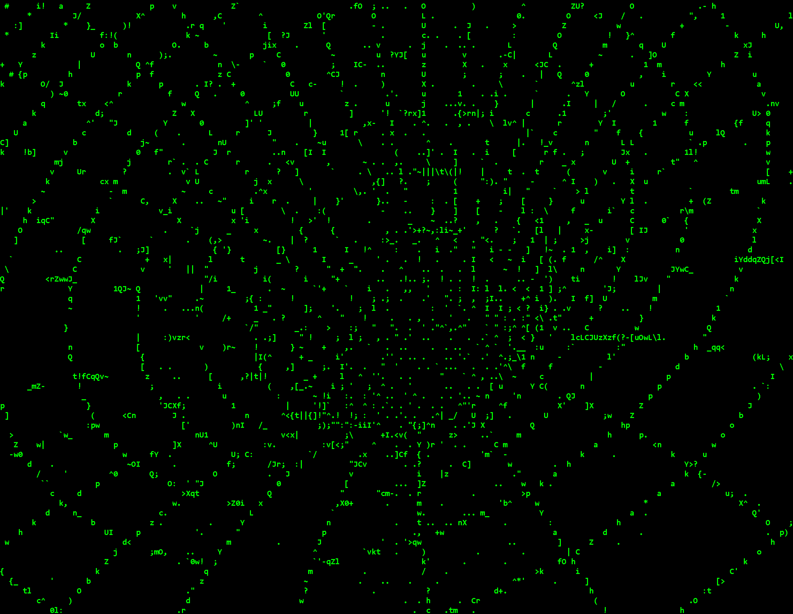

```html
  _______________________________________
< Welcome, to my personal GitHub profile! >
 ----------------------------------------
 \                            .       .
  \                          / `.   .' "
   \                 .---.  <    > <    >  .---.
    \                |    \  \ - ~ ~ - /  /    |
         _____          ..-~             ~-..-~
        |     |   \~~~\.'                    `./~~~/
       ---------   \__/                        \__/
      .'  O    \     /               /       \  "
     (_____,    `._.'               |         }  \/~~~/
      `----.          /       }     |        /    \__/
            `-.      |       /      |       /      `. ,~~|
                ~-.__|      /_ - ~ ^|      /- _      `..-'
                     |     /        |     /     ~-.     `-. _  _  _
                     |_____|        |_____|         ~ - . _ _ _ _ _>
```



```bash
esteban@github:~$ cat about_me.txt
```

```bash
🧑‍🎓 CS Student @ Universidad de Costa Rica  
🔧 Backend Developer focusing on .NET Core & Cloud Technologies
🏗️ Learning Clean Architecture through enterprise-level projects
☁️ Experience with Azure deployment & authentication systems
📊 Data analysis and statistical modeling with Python
🚀 Interested in space tech, algorithm optimization & AI integration
🎮 Game integration enthusiast (KSP API, Minecraft server optimization)
🤖 Exploring AI applications in costumer interaction and development workflows
```

```bash
esteban@github:~$ git log --oneline --graph
```


```bash
              / _)
     _.----._/ /
    /         /
 __/ (  | (  |
/__.-'|_|--|_|
```
<!--
**ebai03/ebai03** is a ✨ _special_ ✨ repository because its `README.md` (this file) appears on your GitHub profile.

Here are some ideas to get you started:

- 🔭 I’m currently working on ...
- 🌱 I’m currently learning ...
- 👯 I’m looking to collaborate on ...
- 🤔 I’m looking for help with ...
- 💬 Ask me about ...
- 📫 How to reach me: ...
- 😄 Pronouns: ...
- ⚡ Fun fact: ...
-->
