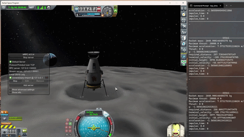

```bash
esteban@github:~$ cowsay -f tux "Welcome to my personal GitHub profile"
```
```html
 _______________________________________
< Welcome to my personal GitHub profile >
 ---------------------------------------
   \
    \
        .--.
       |o_o |
       |:_/ |
      //   \ \
     (|     | )
    /'\_   _/`\
    \___)=(___/
```

---




```bash
esteban@github:~$ cat about_me.txt
```

```bash
🧑‍🎓 CS Student @ Universidad de Costa Rica  
🔧 Backend Developer focusing on .NET Core & Cloud Technologies
☁️ Experience with Azure deployment & authentication systems
📊 Data analysis and statistical modeling with Python
🚀 Interested in space tech, algorithm optimization & AI integration
🎮 Game integration enthusiast (KSP API, Minecraft server optimization)
```

---

```bash
esteban@github:~$ git log --oneline --graph
```


---


---


```bash
esteban@github:~$ cat todo_list.txt
```

```markdown
- [ ] Graduate
- [X] Contribute to open source projects
- [X] Migrate Gitlab projects to GitHub
- [ ] Get certifications in Cloud technologies (Azure, AWS, GCP)
- [X] Contribute to my University
```
